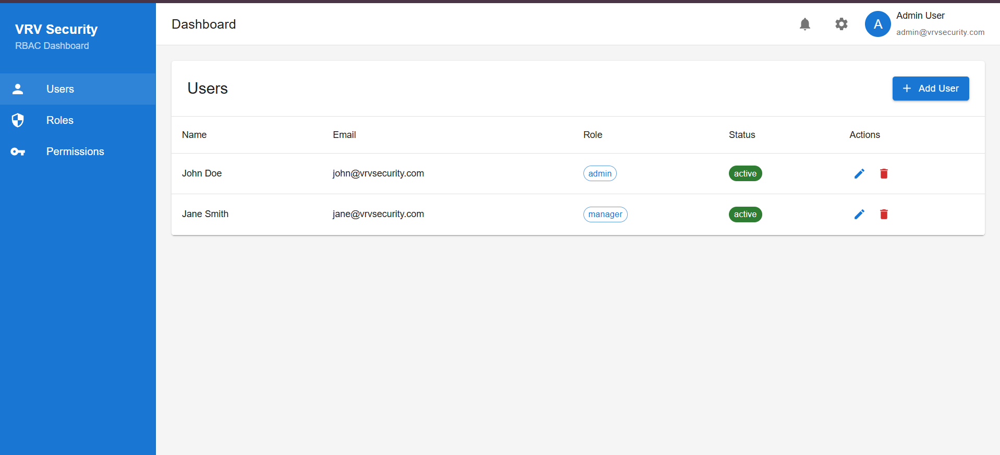
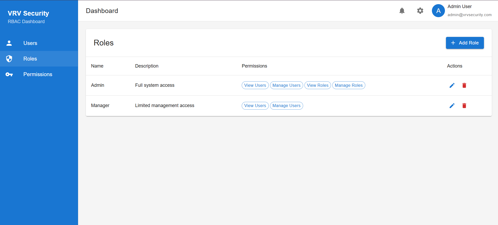
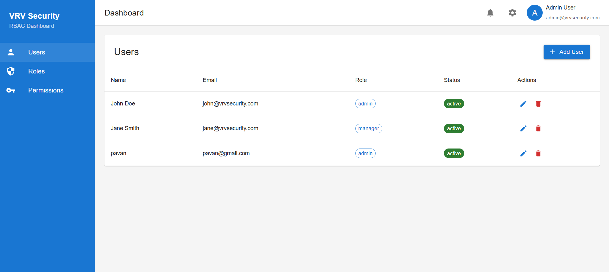
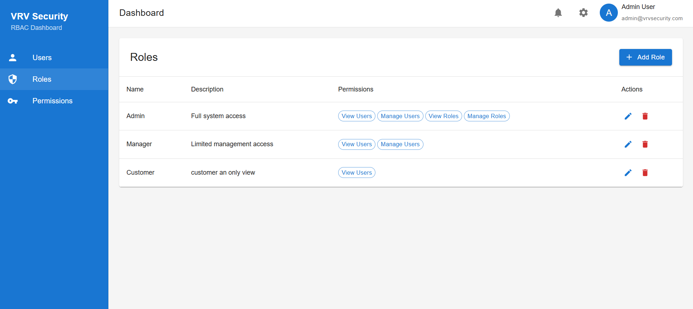
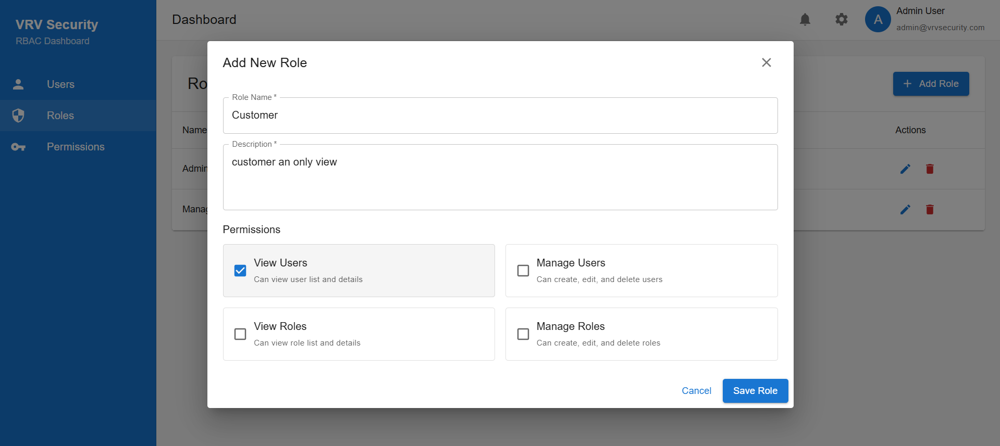
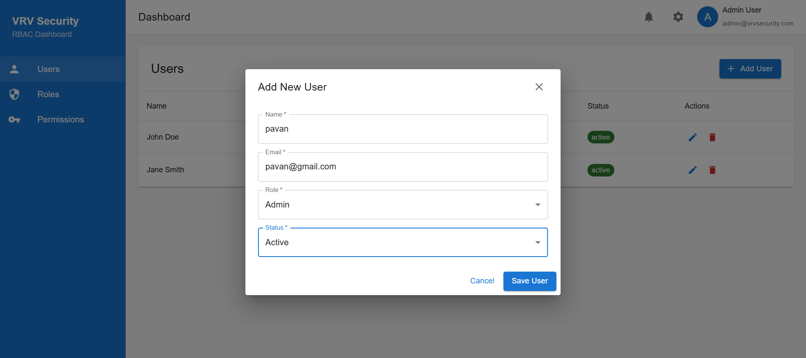
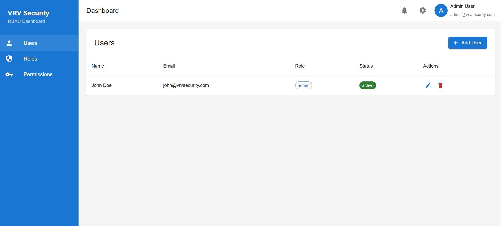

# Role-Based Access Control (RBAC) User Interface

## Overview

This project is a Role-Based Access Control (RBAC) User Interface designed to manage users, roles, and permissions efficiently. Built with Frontend Framework React.js. it focuses on user-friendly interactions, security best practices, and responsiveness.

## Features

### 1. User Management
- View, add, edit, and delete users.
- Assign roles to users and manage their status (Active/Inactive).
- Search and filter users by name, role, or status.

### 2. Role Management
- Create and edit roles.
- Assign permissions (Read, Write, Delete) or custom attributes to roles.
- Role-based filtering and categorization for better visibility.

### 3. Permissions Handling
- Assign, modify, or revoke permissions for roles dynamically.
- Permissions displayed in an easy-to-understand format.
- Error handling for invalid permission assignments.

### 4. Dynamic API Simulation (Mock API)
- CRUD operations simulated for users and roles.
- Mock API responses for validating real-world interactions.

### 5. Additional Features
- Sorting and Filtering: Easily sort users and roles by attributes like name, date added, or permissions.
- Search Functionality: Quick search bar for finding specific users or roles.
- Mobile Responsiveness: Fully responsive design that works seamlessly across all devices.

---

## Technology Stack

- Frontend Framework: React.js
- State Management: Redux
- Styling:TailwindCSS

---

## How to Run

### 1. Prerequisites
- Node.js 
- npm 

### 2. Installation
1. Clone the repository:
  
   git clone https://github.com/pavankalyanvaddadhi/VRV_Admin_App.git

## Screenshots

### *1. User Management Page*

### *2. Role Management Page*

